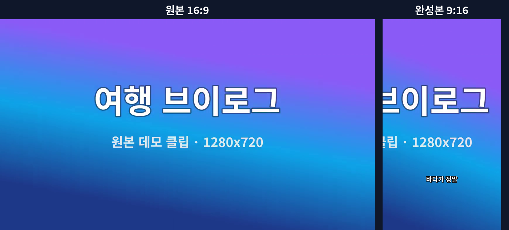
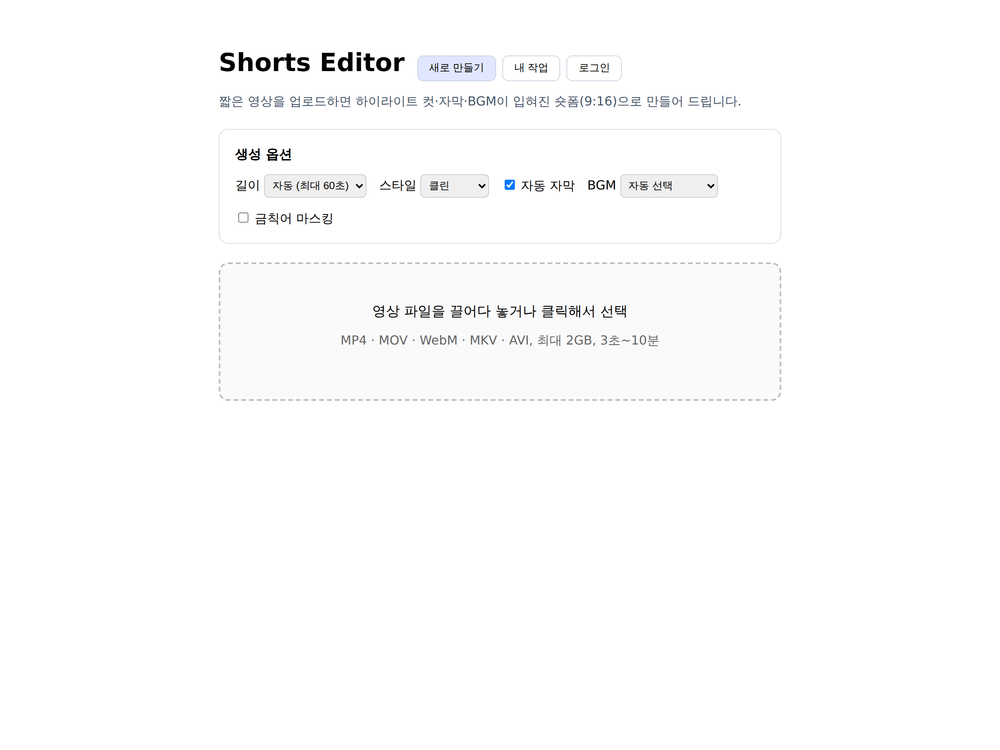
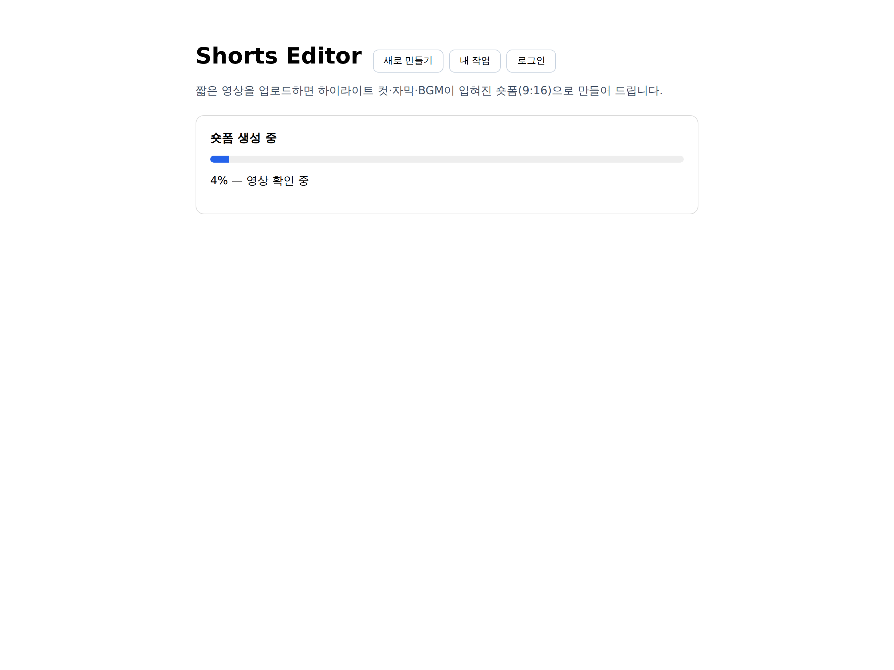
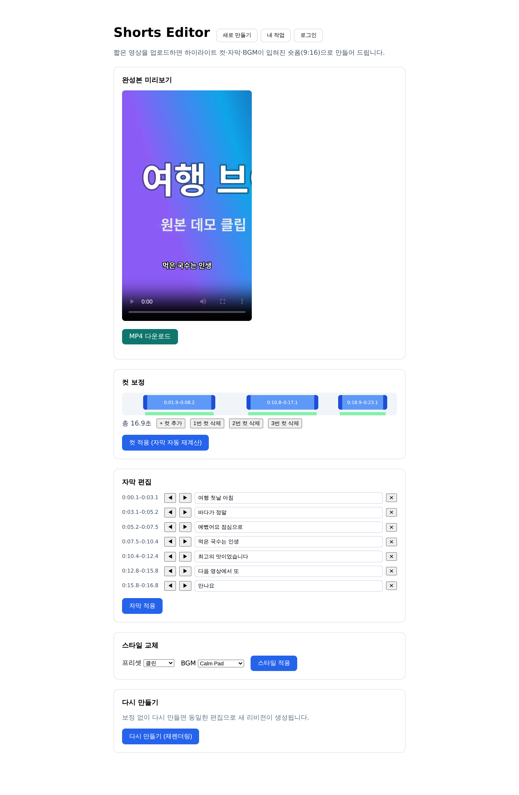
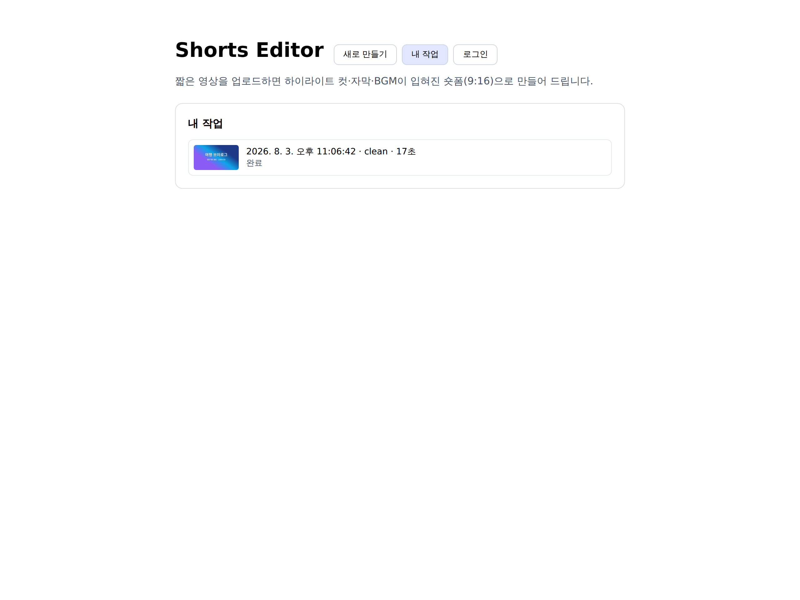

# Shorts Editor

짧은 원본 영상을 업로드하면 이를 자동으로 가공하여 **숏폼(Short-form) 플랫폼에 적합한 세로형 영상**으로 만들어주는 생성기(Generator) 겸 편집기(Editor)입니다.

- 입력: 사용자가 첨부한 짧은 영상(가로/세로 무관, 수 초 ~ 수 분)
- 출력: YouTube Shorts / Instagram Reels / TikTok 규격(9:16, 최대 60초 내외)에 맞춘 완성형 숏폼 영상

## 데모

가로 원본을 업로드하면 하이라이트 컷 선택 → 피사체 추적 크롭 → 자막 번인 → BGM 믹싱을 거쳐
세로 숏폼이 나옵니다. (아래는 합성 데모 클립을 실제 파이프라인으로 처리한 결과입니다)



### 스크린샷

| 업로드 · 생성 옵션 | 생성 진행 (SSE) |
|---|---|
|  |  |

**결과 확인과 보정** — 미리보기, 컷 타임라인(발화 구간 표시), 자막 편집, 스타일 교체, 리비전 재렌더링:



| 작업 이력 |
|---|
|  |

## 프로젝트 상태

**핵심 기능 구현 완료 (v2)** — 계획했던 기능 범위(M0~M4)가 모두 구현되었습니다.
비상업 오픈소스 프로젝트로, 플랫폼 직접 업로드 같은 확장 기능은 범위에서 제외했습니다
([로드맵](docs/09-roadmap.md) 참조). 영상을 업로드하면:

1. 검증·프록시 생성 (Ingest)
2. 장면 분석(샷·모션·얼굴) + STT (Analyze, Python)
3. 하이라이트 컷 선택 + 피사체 추적 크롭 경로 + 자막 블록 + BGM 선택 (Compose)
4. 9:16 변환(track/pad) + 자막·타이틀 카드 번인 + BGM 덕킹 믹스 + 라우드니스 정규화 (Render)

를 거쳐 1080×1920 MP4가 나오고, 웹 UI에서 **컷 타임라인 보정·자막 편집·스타일(프리셋/BGM) 교체 후
재렌더링**(리비전), 생성 옵션(길이/프리셋 4종/자막/BGM/금칙어 마스킹), 잡 이력을 사용할 수 있습니다.
**계정(이메일 가입/로그인)** 을 만들면 익명으로 만든 작업이 계정으로 병합되어 다른 기기에서도 이어집니다.
스토리지는 `STORAGE_DRIVER=local|s3`로 전환할 수 있고, 워커는
`docker compose up --scale worker-render=3`처럼 수평 확장됩니다.
전체 계획은 [로드맵](docs/09-roadmap.md)을 참조하세요.

> STT 모델(faster-whisper)은 첫 실행 시 다운로드됩니다. `WHISPER_MODEL`(기본 `base`)로 크기를
> 조절할 수 있으며, STT를 사용할 수 없는 환경에서는 자막 없이 자동 진행됩니다.

## 시작하기

### 전체 스택 실행 (Docker Compose)

```bash
docker compose up --build
```

| 서비스 | 주소 |
|--------|------|
| 웹 UI | http://localhost:8080 |
| API | http://localhost:3000 (헬스체크: `/healthz`) |

### 로컬 개발

```bash
pnpm install        # Node >= 20, pnpm 10
pnpm build          # 전체 패키지 빌드
pnpm lint           # ESLint
pnpm typecheck      # 타입 검사
pnpm test           # 단위 테스트

# Python 분석 워커 (STT까지 쓰려면 '.[dev,stt]')
pip install './workers/analyze[dev]'
ruff check workers/analyze
pytest workers/analyze/tests

# 하이라이트 가중치 평가 루프 (eval/README.md 참조)
pnpm eval
```

## 문서 목차

| # | 문서 | 내용 |
|---|------|------|
| 1 | [제품 개요](docs/01-overview.md) | 목표, 타겟 사용자, 용어 정의, 범위 |
| 2 | [기능 정의](docs/02-feature-definition.md) | 기능 목록, 우선순위(MoSCoW), 단계별 릴리스 범위 |
| 3 | [기능 명세](docs/03-functional-spec.md) | 기능별 입력/출력/처리 규칙, 유스케이스, 예외 처리 |
| 4 | [처리 파이프라인 명세](docs/04-pipeline-spec.md) | Ingest → Analyze → Compose → Render 각 단계 상세 |
| 5 | [시스템 아키텍처](docs/05-architecture.md) | 구성 요소, 기술 스택, 배포 형태 |
| 6 | [API 명세](docs/06-api-spec.md) | REST API 엔드포인트, 요청/응답 스키마 |
| 7 | [데이터 모델](docs/07-data-model.md) | 엔티티 정의, 상태 머신, 저장 구조 |
| 8 | [비기능 요구사항](docs/08-non-functional.md) | 성능, 용량 제한, 보안, 관측성 |
| 9 | [로드맵](docs/09-roadmap.md) | 마일스톤과 구현 순서 |

## 핵심 컨셉

```
사용자 영상 업로드
      │
      ▼
┌─────────────┐   ┌─────────────┐   ┌─────────────┐   ┌─────────────┐
│   Ingest    │──▶│   Analyze   │──▶│   Compose   │──▶│   Render    │
│ 검증/정규화 │   │ 장면·음성   │   │ 컷 선택,    │   │ 인코딩,     │
│             │   │ 분석        │   │ 리프레이밍, │   │ 규격 출력   │
│             │   │             │   │ 자막·BGM    │   │             │
└─────────────┘   └─────────────┘   └─────────────┘   └─────────────┘
      │
      ▼
완성된 숏폼 영상 다운로드 / 미리보기 / 수동 보정
```

## 라이선스

[MIT](LICENSE)
