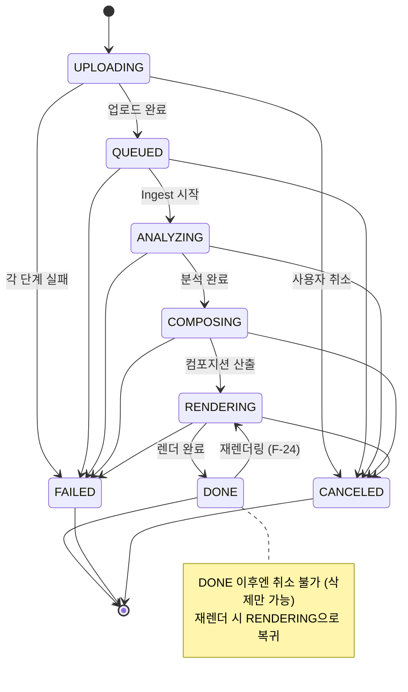

# 7. 데이터 모델 (Data Model)

## 7.1 엔티티 관계

```
Session (익명/계정)
   │ 1:N
   ▼
  Job ──1:1── Source(원본 메타)
   │ 1:1
   ├────────── Analysis (분석 결과 참조)
   │ 1:N
   ├────────── CompositionRevision (컴포지션 리비전)
   │ 1:N
   └────────── Output (렌더 결과물)

Preset, BgmTrack : 전역 카탈로그 (잡과 N:1 참조)
```

## 7.2 테이블 정의 (PostgreSQL)

### `sessions`
| 컬럼 | 타입 | 설명 |
|------|------|------|
| id | text PK | `ses_…` |
| user_id | text NULL | 로그인된 계정 (익명이면 NULL) |
| created_at / last_seen_at | timestamptz | |

### `users` (v2, F-42)
| 컬럼 | 타입 | 설명 |
|------|------|------|
| id | text PK | `usr_…` |
| email | text UNIQUE | 소문자 정규화 저장 |
| password_hash | text | scrypt(salt.hash) |
| created_at | timestamptz | |

> 잡의 계정 귀속은 `jobs.user_id`로 관리한다. 가입/로그인 시 현재 세션의
> 무소속(user_id IS NULL) 잡이 계정으로 병합된다 (익명 이력 병합).

### `jobs`
| 컬럼 | 타입 | 설명 |
|------|------|------|
| id | text PK | `job_…` |
| session_id | text FK → sessions | 소유자 |
| status | text | 상태 머신 값 (§7.3) |
| stage | text NULL | 현재 단계 (`ingest`/`analyze`/`compose`/`render`) |
| progress | int | 0~100 |
| options | jsonb | F-03 생성 옵션 |
| source_meta | jsonb | 길이, 해상도, fps, hasAudio, rotation 등 |
| current_revision | int | 최신 컴포지션 리비전 번호 |
| error_code / error_message | text NULL | 실패 시 |
| internal_error | jsonb NULL | 디버깅용 상세 (사용자 비노출) |
| draft_composition | jsonb NULL | 보정 중인 드래프트 (재렌더링 시 새 리비전으로 확정 후 NULL) |
| cleaned_at | timestamptz NULL | 보관 기한 경과 후 파일 정리 완료 시각 (배치 멱등성) |
| created_at / updated_at / expires_at | timestamptz | expires_at: 산출물 보관 기한 |

### `composition_revisions`
| 컬럼 | 타입 | 설명 |
|------|------|------|
| id | bigserial PK | |
| job_id | text FK → jobs | |
| revision | int | 잡 내 1부터 증가. UNIQUE(job_id, revision) |
| composition | jsonb | composition.json 전문 |
| created_by | text | `auto`(시스템 생성) / `user`(보정 후) |
| created_at | timestamptz | |

### `outputs`
| 컬럼 | 타입 | 설명 |
|------|------|------|
| id | bigserial PK | |
| job_id / revision | FK, int | 어떤 리비전의 렌더인지 |
| storage_key | text | `jobs/{jobId}/output_r{n}.mp4` |
| duration / width / height / size_bytes | | 결과물 스펙 |
| thumbnail_key | text | |
| deleted_at | timestamptz NULL | 보관 기한 경과 시 파일 삭제 마킹 |

### `presets` / `bgm_tracks` (카탈로그)
- `presets`: id, name, description, config(jsonb — 자막 스타일/LUT/전환/기본 BGM 무드), enabled.
- `bgm_tracks`: id, name, mood_tags(text[]), duration, storage_key, license_note, enabled.

> 구현 노트(v1): 카탈로그는 규모가 작아 테이블 대신 **파일 기반**으로 운영한다 —
> 프리셋은 `config/presets/*.json`, BGM은 `assets/bgm/catalog.json`.
> 관리 UI가 필요해지는 시점에 위 테이블 스키마로 이전한다.

### `stt_corrections` (F-22 학습 데이터)
- job_id, block_id, original_text, corrected_text, created_at.

## 7.3 잡 상태 머신



| 상태 | 의미 | 진입 조건 |
|------|------|-----------|
| `UPLOADING` | 청크 수신 중 | 업로드 세션 생성 |
| `QUEUED` | 처리 대기 | complete 호출, Ingest 큐 등록 |
| `ANALYZING` | Ingest+Analyze 진행 | Ingest 워커 시작 |
| `COMPOSING` | 컴포지션 산출 | Analyze 완료 |
| `RENDERING` | 인코딩 중 | Compose 완료 또는 재렌더 요청 |
| `DONE` | 결과 준비 완료 | Render 완료 |
| `FAILED` | 복구 불가 실패 | 각 단계 실패 정책 참조 |
| `CANCELED` | 사용자 취소 | cancel API |

전이 규칙:
- `DONE → RENDERING`: 재렌더링(F-24)의 유일한 역방향 전이. `current_revision` 증가와 함께 발생.
- `FAILED`/`CANCELED`는 종료 상태. 동일 원본 재시도는 새 잡으로 생성한다.
- 상태 갱신은 워커가 소유하며, 낙관적 잠금(`updated_at` 비교)으로 중복 워커 실행을 방지한다.

## 7.4 스토리지 키 규약

```
jobs/{jobId}/
├── source.mp4            # 원본 (확장자는 원본 유지)
├── proxy.mp4             # 분석용 (72h 후 삭제)
├── audio.wav             # STT용 (72h 후 삭제)
├── analysis.json
├── thumbnail.jpg
├── output_r1.mp4
├── output_r1_thumb.jpg
└── output_r2.mp4 …
```

## 7.5 보관/삭제 정책

| 대상 | 정책 |
|------|------|
| 원본, 결과물, analysis | 잡 생성 후 7일 (`expires_at`) 경과 시 파일 삭제 |
| 프록시/오디오 | 잡 완료 후 72시간 |
| 잡 메타데이터, 썸네일 | 파일 삭제 후에도 유지 (이력 표시용), 90일 후 완전 삭제 |
| 리비전 결과물 | 잡당 최근 5개까지만 파일 보관 |
| 업로드 미완료 세션 | 24시간 후 부분 데이터 삭제 |

삭제는 일 배치 워커가 수행하며, 파일 삭제 → `deleted_at` 마킹 → 메타데이터 정리 순서로 진행한다.
